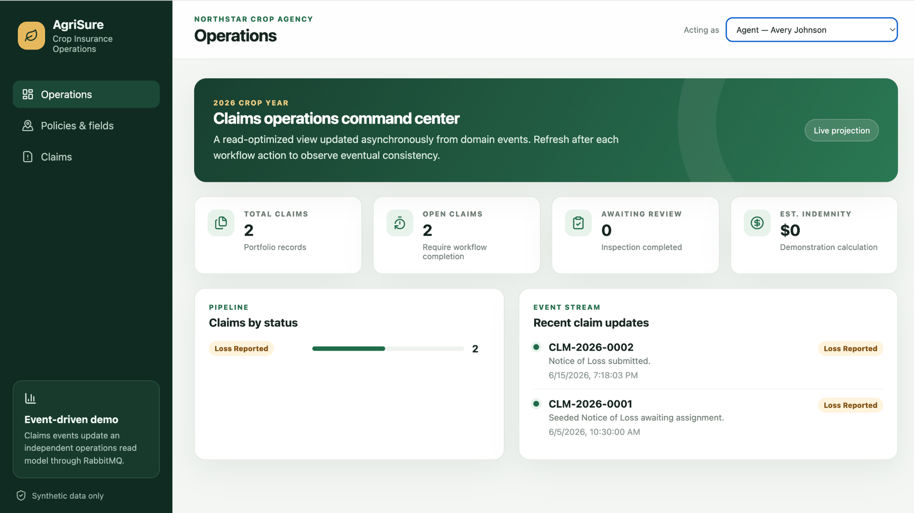
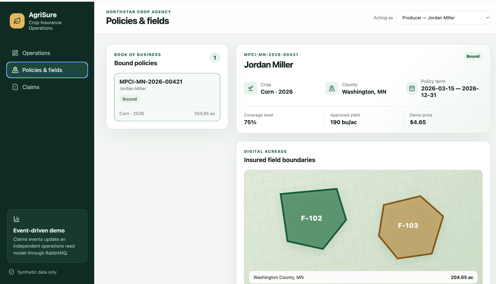
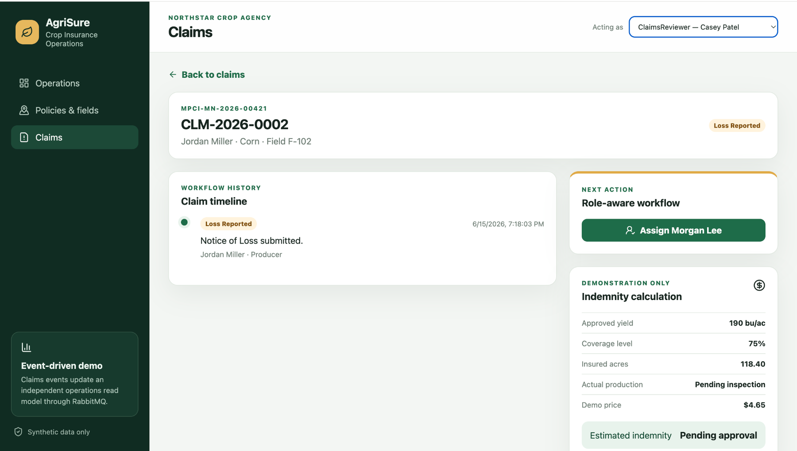
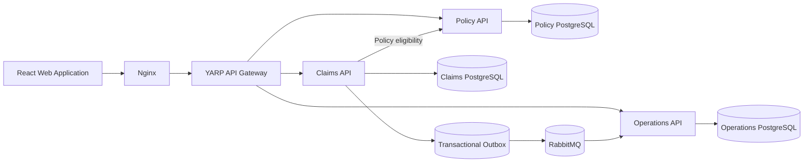

# AgriSure — Crop Insurance Operations Platform

[](https://github.com/Sbadhon/agrisure-crop-insurance-platform/actions/workflows/ci.yml)
[](LICENSE)


AgriSure is an event-driven crop-insurance operations platform that demonstrates a complete vertical slice across policy data, Notice of Loss intake, claims adjustment, settlement workflow, and operational reporting.

The project focuses on the engineering concerns behind a regulated workflow: bounded services, explicit state transitions, tenant-aware authorization, transactional event publication, idempotent consumption, service-owned databases, and operational read models.

> [!IMPORTANT]
> AgriSure is an independent educational project inspired by publicly documented U.S. crop-insurance workflows. It is not affiliated with, endorsed by, or connected to ProAg, USDA, or the Risk Management Agency. All agencies, producers, policies, fields, claims, rates, and payments are synthetic. The indemnity calculation is intentionally simplified and must not be used for real insurance decisions.

<p align="center">
  
</p>

## What the project demonstrates

- A role-aware workflow for producers, agents, claims reviewers, adjusters, and operations staff
- Bound-policy and insured-field eligibility checks before a claim can be created
- A claims state machine covering loss reporting, assignment, inspection, approval, payment request, and payment confirmation
- Transactional outbox processing with asynchronous RabbitMQ publication
- Idempotent Operations-service consumption using persisted event IDs
- Database ownership per bounded service
- A YARP gateway providing one stable API entry point
- Synthetic field boundaries and acreage data for a crop-insurance policy
- Correlation IDs, structured logs, health checks, and OpenTelemetry instrumentation
- Docker Compose and GitHub Actions for repeatable local development and validation

## Product experience

### Policy and insured-field view

The Policy service owns producer, coverage, acreage, and field-boundary information. The UI exposes the bound policy and two synthetic insured fields before a Notice of Loss is submitted.

<p align="center">
  
</p>

### Role-aware claim workflow

Available actions change with the selected synthetic actor and the current claim state. The timeline records each transition, actor, role, note, and timestamp.

<p align="center">
  
</p>

## End-to-end workflow

1. A producer or agent reports crop damage against a bound policy and insured field.
2. The Claims service verifies policy eligibility through the Policy service.
3. The Notice of Loss and its outbox message are committed in one database transaction.
4. A claims reviewer assigns the claim to an adjuster.
5. The assigned adjuster records actual production and inspection notes.
6. A claims reviewer approves the claim.
7. The system calculates a demonstration indemnity.
8. A payment request is created and Operations confirms the simulated payment.
9. Claim events update an independent Operations read model through RabbitMQ.

## Architecture



### Service responsibilities

| Component | Responsibility |
|---|---|
| **Policy API** | Producers, bound policies, coverage information, insured acreage, field boundaries, and claim eligibility |
| **Claims API** | Notice of Loss, assignment, inspection, approval, settlement workflow, timeline, and transactional outbox |
| **Operations API** | Idempotent event consumption, claim projections, pipeline totals, and operational reporting |
| **YARP Gateway** | Stable `/api` entry point and routing to backend services |
| **React application** | Role-aware user experience for all synthetic actors |
| **RabbitMQ** | Asynchronous delivery of claim-domain integration events |

Each transactional service owns its PostgreSQL database. The Operations database is a read model and is not used as the source of truth for claims.

## Reliability model

The project uses at-least-once event delivery:

1. A claim state change and its outbox record are saved atomically.
2. A background worker publishes unprocessed outbox messages to RabbitMQ.
3. The Operations consumer checks `processed_messages` before applying an event.
4. Duplicate deliveries are acknowledged without creating duplicate projections.
5. The consumer updates the read model and records the event ID in one database transaction.

This design accepts that a publisher can send the same event again after a crash and makes the consumer responsible for safe replay.

## Technology

| Area | Technology |
|---|---|
| Backend | .NET 10, C# 14, ASP.NET Core Minimal APIs |
| Frontend | React 19, TypeScript, Vite |
| Frontend runtime | Node.js 22 |
| Gateway | YARP |
| Persistence | Entity Framework Core, PostgreSQL 18 |
| Messaging | RabbitMQ 4 |
| Observability | OpenTelemetry instrumentation, structured logging, health checks |
| Testing | xUnit |
| Delivery | Docker Compose, GitHub Actions |

Backend package versions are centrally managed in [`Directory.Packages.props`](Directory.Packages.props). Frontend versions are pinned through [`package.json`](src/Web/agrisure-web/package.json) and [`package-lock.json`](src/Web/agrisure-web/package-lock.json).

## Run the complete system

### Prerequisites

- Docker Desktop with Docker Compose
- Git

### Start

```bash
git clone https://github.com/Sbadhon/agrisure-crop-insurance-platform.git
cd agrisure-crop-insurance-platform

cp .env.example .env
docker compose up --build
```

Wait until the APIs report that they are listening and the web image has started.

### Open the system

| Component | Address |
|---|---|
| Web application | http://localhost:3000 |
| API gateway health | http://localhost:8080/health |
| Policy API health | http://localhost:5101/health |
| Claims API health | http://localhost:5102/health |
| Operations API health | http://localhost:5103/health |
| RabbitMQ management | http://localhost:15672 |

RabbitMQ development credentials:

```text
Username: agrisure
Password: agrisure-dev
```

The credentials are local-development defaults and can be overridden in `.env`.

### Verify containers

```bash
docker compose ps
```

Expected services:

```text
policy-db
claims-db
operations-db
rabbitmq
policy-api
claims-api
operations-api
gateway
web
```

### Stop

```bash
docker compose down
```

### Reset all synthetic data

```bash
docker compose down --volumes
docker compose up --build
```

A fresh database volume creates one bound policy, two insured fields, and one seeded Notice of Loss. Reporting another loss through the UI creates the next claim and demonstrates the complete intake path.

## Demonstration walkthrough

1. Select **Producer — Jordan Miller**.
2. Open **Policies & fields** and review policy `MPCI-MN-2026-00421`.
3. Inspect fields `F-102` and `F-103`.
4. Open **Claims**.
5. Select **Report a loss** to create a new Notice of Loss.
6. Switch to **ClaimsReviewer — Casey Patel** and assign **Morgan Lee**.
7. Switch to **Adjuster — Morgan Lee** and complete the inspection.
8. Switch back to **ClaimsReviewer — Casey Patel**, approve the claim, and request payment.
9. Switch to **Operations — Riley Chen** and confirm the simulated payment.
10. Open **Operations** and refresh after event processing to see the read model reach `Paid`.
11. Inspect RabbitMQ and the `outbox_messages` and `processed_messages` tables to explain delivery reliability.

A panel-oriented walkthrough is available in [`docs/demo/walkthrough.md`](docs/demo/walkthrough.md).

## Synthetic actors

The frontend sends synthetic identity headers so the repository can focus on the crop-insurance workflow rather than identity-provider configuration.

| Role | Actor |
|---|---|
| Agent | Avery Johnson — `agent-2001` |
| Producer | Jordan Miller — `producer-1001` |
| Claims reviewer | Casey Patel — `reviewer-4001` |
| Adjuster | Morgan Lee — `adjuster-3001` |
| Operations | Riley Chen — `ops-5001` |

Headers used by the demonstration:

```text
X-Tenant-Id
X-Actor-Id
X-Actor-Name
X-Role
X-Correlation-Id
```

This is not production authentication. The intended migration path is documented in [`docs/adr/002-demo-identity-boundary.md`](docs/adr/002-demo-identity-boundary.md).

## Domain rules

- A Notice of Loss requires a bound policy and valid insured field.
- A producer can access only their own policy and claims.
- Tenant ID is applied to persistence lookups.
- A claim cannot skip workflow states.
- Only the assigned adjuster can complete an inspection.
- Approval requires completed inspection data.
- Payment can be requested only after approval.
- Events are stored transactionally before publication.
- Consumers persist processed event IDs and safely ignore duplicate delivery.

## Demonstration calculation

```text
Production guarantee = approved yield × coverage level × insured acres
Loss quantity        = max(production guarantee − actual production, 0)
Estimated indemnity  = loss quantity × demonstration price
```

The application labels this result as a demonstration estimate. It does not implement official RMA or carrier rating, premium, or indemnity logic.

## Build and test

### Backend

```bash
dotnet restore
dotnet build --configuration Release --no-restore
dotnet test --configuration Release --no-build
```

### Frontend

```bash
cd src/Web/agrisure-web
npm ci
npm run build
```

### Make targets

```bash
make restore
make build
make test
make web-build
```

The current CI workflow restores, builds, and tests the backend; installs and builds the frontend; and validates the Docker Compose configuration.

## Repository structure

```text
.
├── src/
│   ├── BuildingBlocks/       Shared technical infrastructure
│   ├── Contracts/            Integration-event contracts
│   ├── Gateway/              YARP gateway
│   ├── Services/
│   │   ├── Policy/           Policy and insured-field bounded context
│   │   ├── Claims/           Claims workflow and transactional outbox
│   │   └── Operations/       Event-driven reporting projection
│   └── Web/                  React application
├── tests/                    Claims domain tests
├── docs/                     Architecture, ADRs, delivery plans, and demo material
├── http/                     HTTP request collection
├── docker-compose.yml
└── AgriSure.sln
```

## Architecture and delivery documents

- [Architecture overview](docs/architecture.md)
- [ADR 001 — Service boundaries](docs/adr/001-service-boundaries.md)
- [ADR 002 — Demonstration identity boundary](docs/adr/002-demo-identity-boundary.md)
- [ADR 003 — Outbox and idempotent projection](docs/adr/003-outbox-and-idempotent-projection.md)
- [Assumptions and risks](docs/delivery/assumptions-risks.md)
- [Implementation plan](docs/delivery/implementation-plan.md)
- [Definition of done](docs/delivery/definition-of-done.md)

## Deliberate scope and limitations

AgriSure does not attempt to reproduce proprietary carrier software or the complete federal crop-insurance system.

The current release intentionally uses:

- Synthetic identities instead of an external OIDC provider
- Synthetic GeoJSON field boundaries instead of a production GIS integration
- A simplified indemnity formula
- Startup-created development schemas and seed data
- Docker Compose rather than production deployment infrastructure

Potential future increments include quoting, underwriting, acreage-report submission, document storage, weather alerts, PostGIS spatial querying, OIDC authentication, versioned database migrations, and cloud deployment.

## License

Licensed under the [MIT License](LICENSE).
