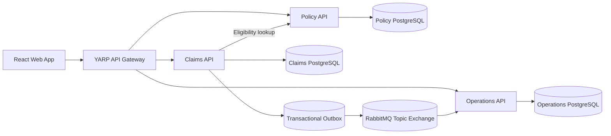

# AgriSure — Crop Insurance Operations Platform

AgriSure is a portfolio-grade, event-driven crop-insurance workflow system. It demonstrates how a technical lead can turn a regulated business process into bounded services, explicit state transitions, durable integration events, tenant-aware authorization, operational read models, and a complete vertical slice.

> **Independent educational project.** AgriSure is not affiliated with, endorsed by, or connected to ProAg, USDA, or the Risk Management Agency. All people, agencies, policies, fields, rates, claims, and payments are synthetic. The calculation shown in the application is intentionally simplified and must not be used for real insurance decisions.

## Demonstrated workflow

A producer or agent reports crop damage against a bound policy. The system then supports:

1. Notice of Loss submission
2. Claims-review assignment
3. Adjuster field inspection
4. Reviewer approval
5. Demonstration indemnity calculation
6. Payment request
7. Simulated payment confirmation
8. Asynchronous operations-dashboard projection

Each state change is written with an outbox record in the same database transaction. A background publisher sends the event to RabbitMQ. The Operations service consumes events idempotently and maintains a read-optimized claim projection.

## Architecture



### Service responsibilities

| Component | Responsibility |
|---|---|
| Policy API | Producers, bound policies, crop coverage, insured fields, synthetic GeoJSON boundaries, claim eligibility |
| Claims API | Notice of Loss, assignment, inspection, approval, settlement workflow, transactional outbox |
| Operations API | Idempotent event consumption, portfolio projection, operations dashboard |
| Gateway | Stable `/api` entry point and service routing |
| React application | Role-aware demonstration UI for producers, agents, adjusters, reviewers, and operations |

## Technology

- .NET 10 and ASP.NET Core Minimal APIs
- C# 14
- React 19, TypeScript, and Vite
- PostgreSQL 18
- RabbitMQ 4 with the asynchronous .NET client
- YARP reverse proxy
- Entity Framework Core
- OpenTelemetry instrumentation
- xUnit
- Docker Compose and GitHub Actions

Versions are centrally managed in `Directory.Packages.props` and `package.json`.

## Run the complete system

### Prerequisites

- Docker Desktop with Compose
- Git

### Start

```bash
cp .env.example .env
docker compose up --build
```

Open:

- Application: http://localhost:3000
- Gateway health: http://localhost:8080/health
- RabbitMQ management: http://localhost:15672
  - Username: `agrisure`
  - Password: `agrisure-dev`

The databases and synthetic demonstration records are created automatically on first startup.

### Stop and reset

```bash
docker compose down
```

Delete all local data and restart from the original seed:

```bash
docker compose down --volumes
docker compose up --build
```

## Demonstration script

1. Start as **Producer — Jordan Miller**.
2. Open **Policies & fields** to inspect the bound corn policy and two mapped fields.
3. Open **Claims**, select **Report a loss**, and submit the Notice of Loss.
4. Switch to **ClaimsReviewer — Casey Patel** and assign Morgan Lee.
5. Switch to **Adjuster — Morgan Lee** and complete the inspection.
6. Switch to **ClaimsReviewer — Casey Patel**, approve the claim, then request payment.
7. Switch to **Operations — Riley Chen** and confirm the simulated payment.
8. Open **Operations** and refresh after the event publisher runs to see the independent read model reach `Paid`.
9. Inspect RabbitMQ and the `outbox_messages` / `processed_messages` tables to explain reliability and idempotency.

A detailed walkthrough is in [`docs/demo/walkthrough.md`](docs/demo/walkthrough.md).

## Local development without Docker

Start PostgreSQL and RabbitMQ locally, update the connection strings in each `appsettings.json`, then run:

```bash
dotnet restore
dotnet build
dotnet test
```

In another terminal:

```bash
cd src/Web/agrisure-web
npm ci
npm run dev
```

Run the APIs on their configured development ports:

```bash
dotnet run --project src/Services/Policy/AgriSure.Policy.Api
dotnet run --project src/Services/Claims/AgriSure.Claims.Api
dotnet run --project src/Services/Operations/AgriSure.Operations.Api
dotnet run --project src/Gateway/AgriSure.Gateway
```

## Synthetic actors

The frontend intentionally uses headers to simulate an external identity provider so the repository stays focused on the insurance workflow.

| Role | Actor |
|---|---|
| Agent | Avery Johnson (`agent-2001`) |
| Producer | Jordan Miller (`producer-1001`) |
| Claims reviewer | Casey Patel (`reviewer-4001`) |
| Adjuster | Morgan Lee (`adjuster-3001`) |
| Operations | Riley Chen (`ops-5001`) |

Headers used by the demo:

```text
X-Tenant-Id
X-Actor-Id
X-Actor-Name
X-Role
X-Correlation-Id
```

This is not production authentication. The production migration path is documented in [`docs/adr/002-demo-identity-boundary.md`](docs/adr/002-demo-identity-boundary.md).

## Domain rules implemented

- Only a bound policy is eligible for a Notice of Loss.
- A producer can access only their own policy and claims.
- An adjuster can access and inspect only assigned claims.
- A claim cannot skip workflow states.
- Only the assigned adjuster can complete the inspection.
- Approval requires inspection production data.
- Payment can be requested only after approval.
- Events are persisted transactionally before publication.
- Consumers record event IDs and safely ignore duplicate delivery.
- Tenant ID is checked at every persistence lookup.

## Demonstration calculation

```text
Production guarantee = approved yield × coverage level × insured acres
Loss quantity        = max(production guarantee − actual production, 0)
Estimated indemnity  = loss quantity × demonstration price
```

The calculation is deliberately labeled as a demonstration and does not represent official RMA or carrier rating logic.

## Testing and quality checks

```bash
make restore
make build
make test
make web-build
```

The unit tests verify the claim state machine, assigned-adjuster rule, and simplified indemnity calculation. CI restores, builds, tests, builds the frontend, and validates the Compose configuration.

## Repository structure

```text
src/
├── BuildingBlocks/       Technical cross-cutting behavior only
├── Contracts/            Versioned integration-event contracts
├── Gateway/              YARP edge service
├── Services/
│   ├── Policy/           Policy and insured-field bounded context
│   ├── Claims/           Claims workflow and outbox
│   └── Operations/       Event-driven reporting projection
└── Web/                  React role-aware user interface

tests/                    Domain unit tests
docs/                     ADRs, risks, estimates, and knowledge material
http/                     Ready-to-run HTTP request collection
```

## Architecture and delivery documents

- [`docs/architecture.md`](docs/architecture.md)
- [`docs/adr/001-service-boundaries.md`](docs/adr/001-service-boundaries.md)
- [`docs/adr/002-demo-identity-boundary.md`](docs/adr/002-demo-identity-boundary.md)
- [`docs/adr/003-outbox-and-idempotent-projection.md`](docs/adr/003-outbox-and-idempotent-projection.md)
- [`docs/delivery/assumptions-risks.md`](docs/delivery/assumptions-risks.md)
- [`docs/delivery/implementation-plan.md`](docs/delivery/implementation-plan.md)
- [`docs/delivery/definition-of-done.md`](docs/delivery/definition-of-done.md)

## Deliberate scope choices

The repository does **not** attempt to reproduce proprietary carrier software or the complete federal crop-insurance rating system. It also avoids one microservice per entity. The first release contains the smallest set of independently meaningful boundaries needed to demonstrate business workflow, integration reliability, and operational ownership.

Future increments include quoting, underwriting, acreage-report submission, document storage, weather alerts, PostGIS spatial querying, real OIDC authentication, database migrations, and deployment infrastructure. They are prioritized in the implementation plan rather than represented by unfinished code.

## License

MIT. See [`LICENSE`](LICENSE).
